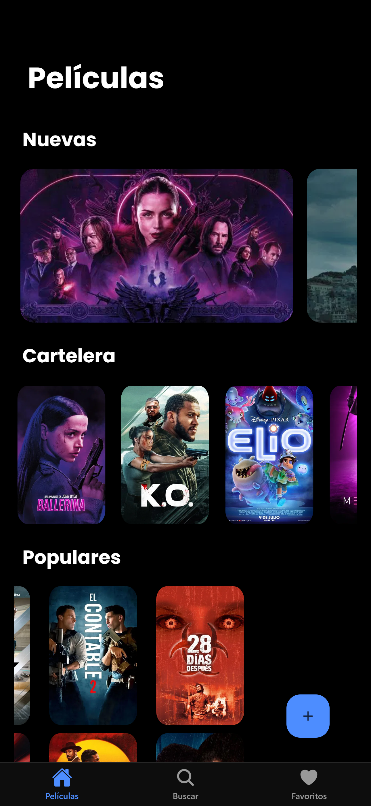
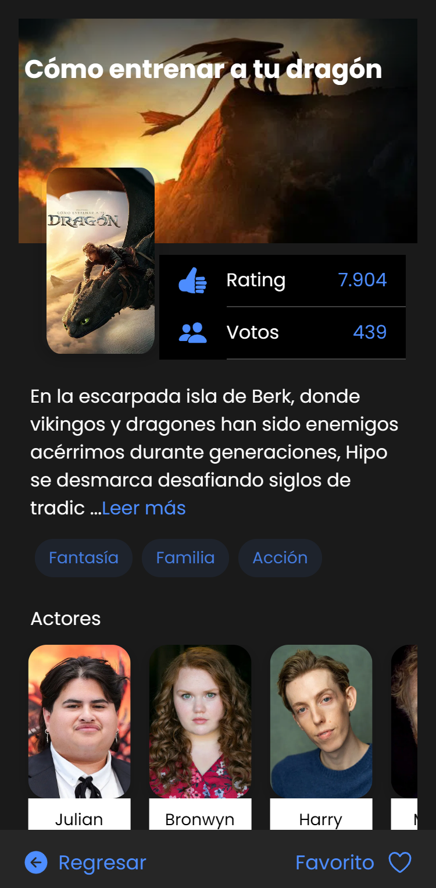
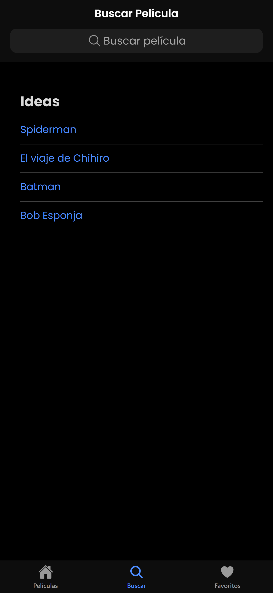
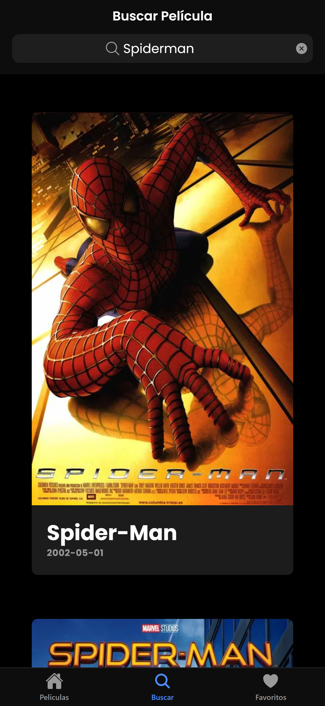
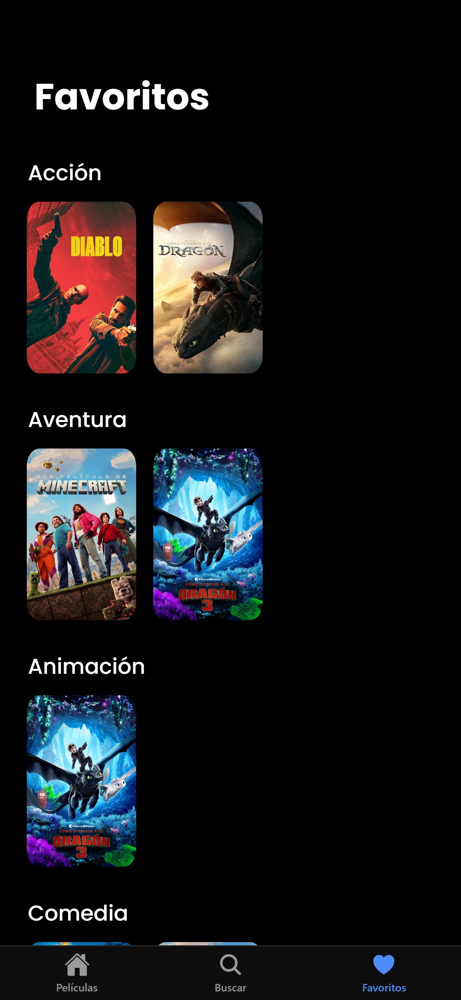

# 🎬 Aplicación Móvil de Películas

## 📱 Descripción General

Aplicación móvil desarrollada con **Ionic Framework con Angular** que permite consultar información sobre películas, buscar, ver sus detalles (como sinopsis, actores y géneros), y además de marcarlas como favoritas, donde la app hace uso de almacenamiento local (Storage) para persistir la sección de los favoritos. Toda la información es obtenida desde la API de **The Movie Database (TMDB)** para obtener datos actualizados de estrenos, películas populares, información detallada y reparto.

## 🛠️ Tecnologías y dependencias utilizadas

- **[Ionic Framework](https://ionicframework.com/)** (v6+)
- Angular
- [The Movie DB API](https://www.themoviedb.org/)
- Ionic UI Components
- Firebase Hosting
- Android Studio

## 🚀 Instalación y ejecución local

### 🌐 Opción 1: Acceder directamente a la aplicación desplegada como PWA
Accede desde tu navegador a:
👉 link: [PWA Movies](https://appmovies-569d9.web.app)

### 💻 Opción 2: Clonar y ejecutar localmente
1. Clona este repositorio o descarga el proyecto.
2. Abre una terminal en el directorio del proyecto.
3. Ejecuta los siguientes comandos, para instalar dependencias y correr en el navegador:
```bash
npm install
ionic serve
```
5. Comandos para correr en Android:
```bash
ionic build
npx cap add android
npx cap open android
```
### 📱 Opción 3: Instalar APK de la aplicación
Accede desde tu navegador a:
👉 link: [APK Movies](https://correobuap-my.sharepoint.com/:f:/g/personal/scarlett_xochicalef_alumno_buap_mx/EtKhvUAsUFFBq8kTC2_NGSoBQo2luWN_izFdGd4sP5LggA?e=abdI59)

## 📸 Capturas de pantalla


### 🏠 Pantalla Principal


### 🎬 Detalle de Película


### 🔍 Buscar películas



### ⭐ Favoritos



## 📌 Créditos
Este proyecto fue desarrollado como parte del curso de Udemy:
"Legacy - Ionic 6: Crear aplicaciones iOS, Android con Angular"
Impartido por: Fernando Herrera
Perfil del instructor en Udemy: [Fernando Herrera](https://www.udemy.com/user/550c38655ec11/?kw=fernando+herrera&src=sac)

## 👨‍💻 Proyecto Final Realizado por: 
Estudiantes de la BUAP - Facultad de Ciencias de la Computación

* Angelica Rodriguez Vallejo
* Juan Yahir Sánchez Pérez
* Scarlett Itzel Xochicale Flores
